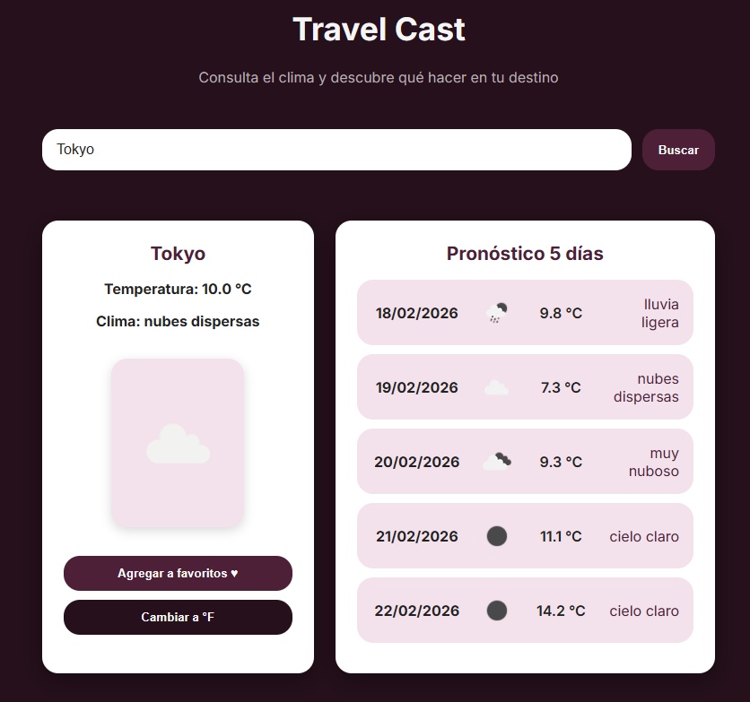
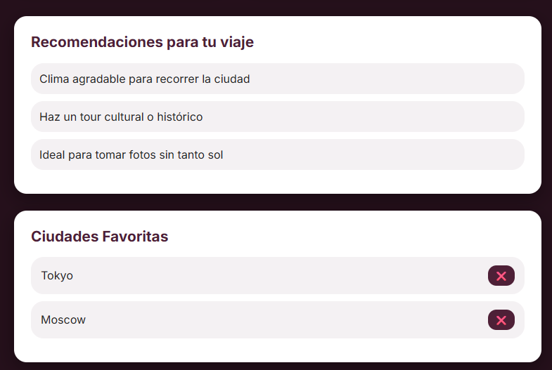

# Travel Cast

Travel Cast es una aplicación web interactiva que permite consultar el clima actual y el pronóstico de 5 días en cualquier ciudad del mundo, además de ofrecer recomendaciones turísticas dinámicas según las condiciones climáticas.

La aplicación fue desarrollada con HTML5, CSS3 y JavaScript Vanilla, integrando almacenamiento local para historial y favoritos.

---

## Funcionalidades

- Búsqueda de ciudades con autocompletado
- Consulta de clima actual y pronóstico extendido
- Recomendaciones de viaje según el clima
- Cambio de unidades (°C / °F)
- Historial de búsquedas guardado en localStorage
- Guardado de ciudades favoritas
- Implementa Circuit Breaker y Retry
---

## API Utilizada

Este proyecto consume datos meteorológicos en tiempo real desde:

- OpenWeatherMap API
  https://openweathermap.org/

Todos los derechos de los datos e iconos del clima pertenecen a OpenWeatherMap.

---

## Instalación y Ejecución

### Opción 1: Ejecutar en local

1. Descarga o clona este repositorio:

```bash
git clone https://github.com/tu-usuario/travel-cast.git
```
2. Abre el proyecto en tu editor de código.

3. Ejecuta el archivo index.html usando un servidor local (por ejemplo Live Server en VS Code).

### Opción 2: Versión en línea
- También puedes probar la aplicación directamente desde el sitio publicado:

Demo: [Travel Cast](https://ingridzmendoza.github.io/TravelCast/)

---
## Imágenes del Proyecto

Las capturas de pantalla del proyecto se encuentran en:
```bash
/assets/screenshots/
```
<p>
  <br>
  <br>
  
</p>


